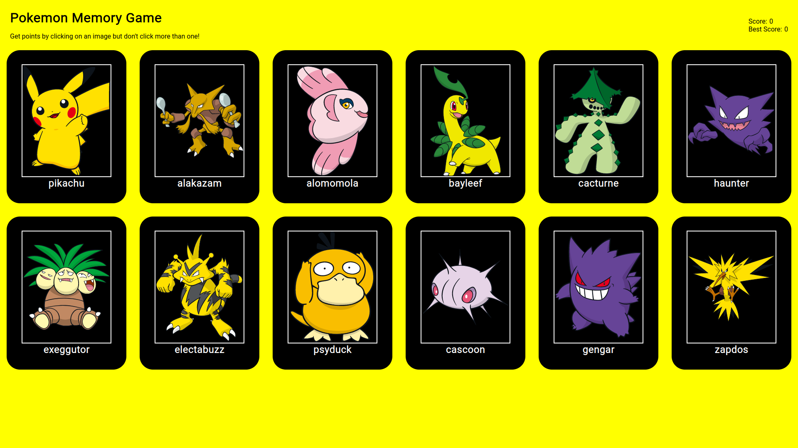

# Memory-Game

A memory card game created with pokemon characters and react

# How-to-play
Your goal is to select as many characters as possible without clicking on the same one twice. Your score is incremented by 1 each time you successfully pick a card you hadn't selected yet and it is reset to 0 when you select the same card twice.